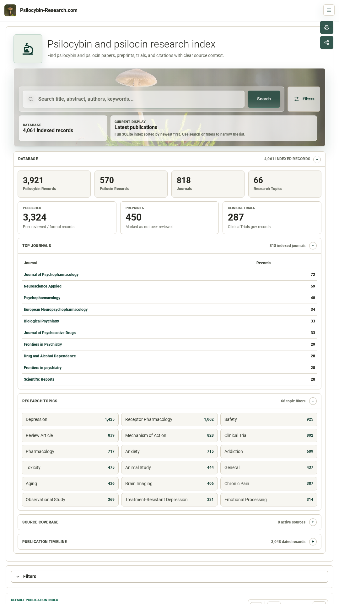
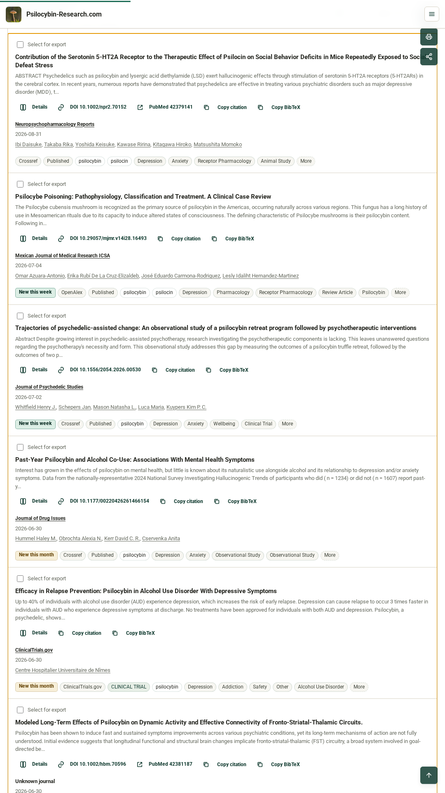
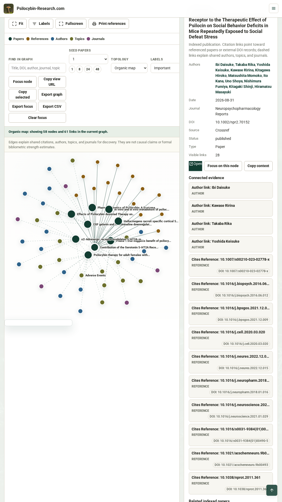

<p align="center">
  <a href="https://psilocybin-research.com/">
    
  </a>
</p>

<h1 align="center">Psilocybin Research Tracker</h1>

<p align="center">
  A self-contained research application for psilocybin and psilocin literature.
</p>

<p align="center">
  <a href="https://psilocybin-research.com/">Live App</a>
  ·
  <a href="https://psilocybin-research.com/about.php">About</a>
  ·
  <a href="https://psilocybin-research.com/api.php">API</a>
  ·
  <a href="android/README.md">Android / Google Play</a>
</p>

<p align="center">
  <a href="https://github.com/psilocybin-research/psilocybin-research-tracker/actions/workflows/ci.yml"></a>
  <a href="LICENSE"></a>
  <a href="CITATION.cff"></a>
  
  
  
  
</p>

<p align="center">
  
  
  
</p>

Self-contained PHP + SQLite research application for psilocybin and psilocin literature at `https://psilocybin-research.com/`.

The tracker helps researchers, clinicians, journalists, policy analysts, and advanced public readers find, filter, evaluate, cite, export, monitor, and explore relevant publications while preserving scientific context: source database, publication status, preprint warnings, clinical-trial records, topics, substances, journals, dates, DOI/PubMed links, alerts, API access, offline-friendly PWA behavior, and Android app packaging.

Production is deployed at the domain root only; do not use or recreate the former `/publication-tracker/` live URL.

## Highlights

| Area | What it provides |
| --- | --- |
| Literature discovery | Keyword, author, journal, topic, study type, substance, year, source, status, and date filters |
| Scientific context | Source/status badges for peer-reviewed records, preprints, protocols, reviews, and clinical trials |
| Citation workflow | BibTeX, RIS, CSV, JSON, LaTeX, copy-citation controls, DOI/PubMed links |
| Research intelligence | Analytics, top journals/authors/topics, citation network, related evidence views |
| Monitoring | Double opt-in email alerts and Web Push notifications for newly imported records |
| Portability | Public API, widgets, SQLite download endpoint, R bibliometrics script, installable PWA, Android TWA wrapper |
| Privacy posture | No CDN JavaScript/CSS/fonts, no tracking pixel in alert emails, runtime secrets excluded from git |

## What Is Included

- Plain PHP 8+ application with SQLite storage.
- Publication importers for PubMed, Crossref, Europe PMC, OpenAlex, medRxiv, bioRxiv, PsyArXiv, and ClinicalTrials.gov.
- Search, advanced filters, citation copy, export formats, public JSON API, widgets, analytics, alerts, PWA offline fallback, and Web Push support.
- R analysis script for live SQLite download, bibliometric tables, PDF figures, and interactive `visNetwork` citation maps.
- Android Trusted Web Activity wrapper under `android/` for Google Play distribution.
- GitHub CI, issue templates, pull request checklist, security policy, and `CITATION.cff` metadata.
- Local frontend assets only: no CDN JavaScript, CSS, or fonts.

## What Is Not Included

Runtime state is intentionally excluded from the public repository:

- live SQLite databases and backups
- admin tokens, VAPID private keys, alert subscriptions, push subscriptions
- logs, locks, heartbeat files, diagnostics
- Android signing keystores, signing properties, APKs, and AABs
- local notes and credential files

Use `.env.example`, `schema.sql`, and the setup commands below to create a fresh local instance.

## Setup

The app runs on PHP 8+ with PDO SQLite enabled.

```bash
cd psilocybin-research.com/publication-tracker
php bin/update.php --backfill
```

The first request or command initializes `data/publications.sqlite` from `schema.sql`. The `data/` directory is blocked from web access by `.htaccess`.

Optional environment variables:

- `PUBLICATION_TRACKER_DATA_DIR`: writable directory for SQLite and token files.
- `PUBLICATION_TRACKER_DSN`: PDO DSN. Defaults to `sqlite:data/publications.sqlite`.
- `PUBLICATION_TRACKER_DB_USER` / `PUBLICATION_TRACKER_DB_PASSWORD`: used for PostgreSQL/MySQL later.
- `PUBLICATION_TRACKER_ADMIN_TOKEN`: admin refresh token. If unset, a random token is generated in `data/admin_token.php`.
- `PUBLICATION_TRACKER_NCBI_EMAIL`: recommended by NCBI for E-utilities usage.
- `PUBLICATION_TRACKER_NCBI_API_KEY`: optional NCBI API key.

Copy `.env.example` if you want a local environment file. Never commit a populated `.env`.

## Database Schema

`schema.sql` creates:

- `publications`: title, authors, abstract, journal, publication date/year, DOI, PubMed ID, source URL, keywords, substance tags, source name, publication status, date added, last checked, raw metadata.
- `fetch_runs`: status, imported/updated/skipped/error counts, timing, source.
- `fetch_errors`: API/import error messages.
- `alert_subscriptions`: email, frequency, keywords, substance settings, active flag.
- `alert_deliveries`: duplicate-prevention table keyed by subscription, paper, and frequency.

Publication rows also include automatic `topic_tags`, `study_type`, normalized `publication_status`, and admin curation fields: `hidden`, `false_positive`, `curation_notes`, and `merged_into_id`.

Deduplication order is DOI, then PubMed ID, then normalized title only when DOI and PubMed ID are absent.

## Updating Publications

The public page reads from SQLite first. Visitors can optionally click **Refresh recent papers** to run a bounded recent-window import. This public refresh:

- uses the same 7-day daily update window
- is protected by a server-side lock file at `data/public_refresh.lock`
- has a one-hour cooldown after the latest successful fetch
- cannot run custom date ranges or historical backfills

Admin/manual refresh remains available for custom ranges.

Daily cron-compatible command:

```bash
php /var/www/vhosts/h84632.host226.alfahosting-server.de/html/psilocybin-research.com/bin/update.php --daily
```

The active production cron runs at 03:20 server time and appends output to `data/update.log`:

```cron
20 3 * * * cd /var/www/vhosts/h84632.host226.alfahosting-server.de/html/psilocybin-research.com && php bin/update.php --daily >> data/update.log 2>&1
```

Daily mode fetches a recent publication window, currently the last 7 days, and logs imported, updated, skipped, and error counts. Repeated runs are safe because DOI and PubMed ID uniqueness prevent duplicate inserts.

Historical backfill:

```bash
php bin/update.php --backfill
```

Manual custom range:

```bash
php bin/update.php --from=2024-01-01 --to=2024-12-31
php bin/update.php --from=2019-01-01 --to=2020-12-31 --source=OpenAlex
```

Data sources currently implemented:

- PubMed / NCBI E-utilities
- Crossref
- Europe PMC
- OpenAlex
- medRxiv
- bioRxiv
- PsyArXiv / OSF Preprints
- ClinicalTrials.gov

The fetcher service is isolated under `src/Fetchers/`; new sources should implement `FetcherInterface` and be registered in `PublicationService::create()`.

Each source should set `source_name` and, where possible, `publication_status`. Supported statuses are:

- `published`
- `preprint`
- `clinical trial`
- `protocol`
- `review`

OpenAlex is part of the core source stack because it provides broad metadata, full author display names, ORCID/OpenAlex author IDs, citation counts, topics, DOI/PMID enrichment, and dedupe support. ScienceDirect/Elsevier API access should remain optional and publisher-specific because it is credential/licensing constrained and Crossref, PubMed, Europe PMC, and OpenAlex already cover most relevant bibliographic records.

The recommended next expansion order is DOAJ, Semantic Scholar for later citation-graph enrichment, ISRCTN/WHO ICTRP, then subscription/optional sources such as Scopus, Web of Science, arXiv, SSRN, and ScienceDirect/Elsevier if stable permitted metadata access is confirmed. Preprints must remain visibly marked as `PREPRINT (not peer reviewed)` and clinical-trial records should not be blended into the peer-reviewed publication feed without a status/source badge.

The visual layer uses local header/preloader imagery plus generated panel accent graphics. Keep decorative effects low-motion: prefer opacity, border, color, shadow, and blend-mode feedback over moving panels or buttons on hover/tap.

## Frontend Assets

Readable source files are kept in `assets/styles.css` and `assets/app.js`. Visitors are served generated minified files:

```bash
bash bin/build-assets.sh
```

The build requires `esbuild` locally and writes `assets/styles.min.css` and `assets/app.min.js`. Do not edit minified assets by hand.

Backfill mode is not capped. PubMed paginates through all ESearch results with `retstart`; Crossref and OpenAlex paginate with cursors per query term. `--limit=` / `--max=` are optional debugging caps only.

## Results and Status

The homepage uses one canonical publication list. With no filters, it shows latest publications; after search or filtering, the same list becomes search results.

```sql
SELECT * FROM publications
WHERE publication_date IS NOT NULL
ORDER BY publication_date DESC, id DESC;
```

Each row includes title, journal, publication date, authors, DOI/PubMed links, source/status badges, and substance tags. This section updates automatically after successful imports because it reads directly from SQLite.

The timestamp beside the latest papers comes from the most recent successful `fetch_runs` entry. On page load, `assets/app.js` calls `status.php`, which only checks SQLite and returns update freshness. While that lightweight request is pending, the page shows:

```text
Checking for newly published papers…
```

If the last successful automated update is older than 32 hours, the UI shows:

```text
Latest automated update is pending.
```

If the lightweight status request fails, the UI keeps showing stored papers and displays a friendly status error. This preloader indicates page/status loading only; it does not mean every visitor triggers a full scientific database import.

## Research Features

The public interface supports:

- keyword search
- dedicated author search
- substance filter
- year, journal, date range, topic, and study-type filters
- citation copy buttons
- paged latest-paper navigation in groups of 5
- filtered export links
- saved-search alerts by keyword, author, journal, substance, and topic

Automatic classification is rule-based and runs on import/backfill:

- `topic_tags`: clinical topics, neuroscience/biology, aging/longevity, wellbeing, research type, population, safety, and future omics categories.
- Featured topics include Depression, Anxiety, Addiction, Microdosing, Neuroplasticity, Clinical Trial, Aging, Telomeres, Epigenetics, Longevity, Brain Imaging, Safety, Mystical Experience, Consciousness, and Biomarkers.
- `study_type`: Randomized Controlled Trial, Clinical Trial, Meta-Analysis, Systematic Review, Review Article, Case Report, Observational Study, Animal Study, In Vitro Study, Qualitative Study, or Other.

To classify existing rows after a schema upgrade:

```bash
php bin/classify-existing.php
```

## Exports, API, Widget

Exports preserve the current filter query string:

```text
/export.php?format=bibtex
/export.php?format=ris
/export.php?format=csv
/export.php?format=json
/export.php?format=csv&limit=50000
```

Public JSON API:

```text
/api.php
/api.php?resource=latest&limit=5&offset=5
/api.php?resource=analytics
/api.php?resource=authors&q=Carhart
/api.php?resource=topics
/api.php?resource=study_types
/api.php?resource=journals
/api.php?resource=paper&id=123
/api.php?resource=citation&id=123
```

Embeddable latest-5 homepage widget:

```text
/widget.php
<script src="/widget.js.php" data-target="publication-widget"></script>
```

The API and widget read SQLite only. They do not query upstream source APIs.

## R Bibliometrics Toolkit

The downloadable R script in `tools/psilocybin_bibliometrics_visnetwork.R` pulls the current public SQLite database from `database.php` and creates:

- CSV tables for publications, authors, topics, citation edges, journals, sources, study types, and yearly counts
- PDF figures for records by year, top journals, and top topics
- an interactive `visNetwork` HTML citation map
- optional PDF/PNG snapshots of the network via `webshot2`
- a compact HTML bibliometric report

Run it with:

```bash
Rscript tools/psilocybin_bibliometrics_visnetwork.R
```

Useful runtime filters:

```bash
PSILO_MAX_PAPERS=500 PSILO_FROM_YEAR=2020 Rscript tools/psilocybin_bibliometrics_visnetwork.R
PSILO_STATUS="published,preprint" PSILO_TOPIC=depression Rscript tools/psilocybin_bibliometrics_visnetwork.R
```

## Analytics and Curation

The admin/debug rail includes an analytics dashboard:

- publication trends
- dependency-free SVG publication timeline with preset and custom date ranges
- top authors
- top journals
- topic distribution
- study-type distribution

Admin curation tools require the admin token and support:

- editing substance/topic/study-type tags
- hiding irrelevant papers
- marking false positives
- adding curation notes
- merging duplicate records by marking a duplicate hidden and pointing it to a canonical record

## Alerts

Subscriptions live in `alert_subscriptions`. Generated delivery records live in `alert_deliveries`, which prevents duplicate alerts for the same subscriber and paper.

Email-ready digest output:

```bash
php bin/alerts.php --frequency=daily
php bin/alerts.php --frequency=weekly
php bin/alerts.php --frequency=monthly
```

Preview without marking papers delivered:

```bash
php bin/alerts.php --frequency=daily --preview
```

The app supports double opt-in alert subscriptions and digest delivery. Keep sender identity, VAPID keys, and mail infrastructure configuration outside git.

## Android / Google Play

The `android/` directory contains the Trusted Web Activity wrapper and Play Store preparation docs.

Release signing files and generated upload artifacts are local-only and ignored by git:

- `android/keystore/`
- `android/release/`
- `android/twa/local.properties`

Build locally with:

```bash
bash android/build-release.sh
```

After enrolling in Google Play App Signing, add the Play App Signing SHA-256 certificate fingerprint to `.well-known/assetlinks.json` before publishing production installs.

## Admin / Debug

Open `/#admin`. Custom manual refresh, curation, merging, and backfill workflows require the admin token. Fetch status and API errors are visible in the admin panel.

If `PUBLICATION_TRACKER_ADMIN_TOKEN` is not set, read the generated token on the server:

```bash
php -r "echo include 'data/admin_token.php';"
```

## Migrating From SQLite

The application uses PDO through `Database` plus repository classes, so request handlers do not hardcode SQLite calls. To migrate:

1. Create equivalent tables in PostgreSQL/MySQL from `schema.sql`.
2. Set `PUBLICATION_TRACKER_DSN`, `PUBLICATION_TRACKER_DB_USER`, and `PUBLICATION_TRACKER_DB_PASSWORD`.
3. Replace SQLite-specific `INSERT OR IGNORE` statements in `AlertService` with the target database's upsert syntax.
4. Keep repository method signatures unchanged.

## Tests

Run:

```bash
php tests/run.php
```

Tests cover deduplication, date filtering, latest 5 ordering, last successful update timestamp, preloader/status wiring, search/filter behavior, inserts, duplicate alert prevention, and daily/backfill update mode parsing.
